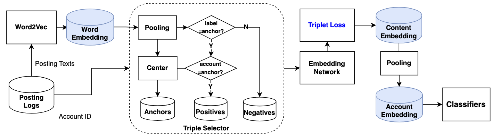
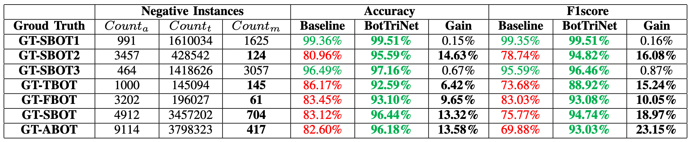

# BotTriNet: A unified and efficient embedding for social bots detection via metric learning

## Introduction
BotTriNet, a unified embedding framework that leverages the textual content posted by accounts to detect bots. We designed a triplet network that refines raw embeddings using metric learning techniques. The framework produces word, content, and account embeddings, which we evaluate on a real-world dataset consisting of three bot account categories and five bot sample sets. Our approach achieves state-of-the-art performance on two content-intensive bot sets, with an average accuracy of 98.34% and f1score of 97.99%. Moreover, our method makes a significant breakthrough on four contentless bot sets, with an average accuracy improvement of 11.52% and an average f1score increase of 16.70%. 

## Publication

The affiliated paper of this repository is accepted at ISDFS 2023.

- [Jun Wu*](https://scholar.google.com/citations?user=rp6B9i0AAAAJ); Xuesong Ye; Yanyuet Man.

	**BotTriNet: A unified and efficient embedding for social bots detection via metric learning**

	 2023 11th International Symposium on Digital Forensics and Security (ISDFS), Chattanooga, TN, USA, May 2023.

```bibtex
@inproceedings{wu2023bottrinet,
  title={Bottrinet: A unified and efficient embedding for social bots detection via metric learning},
  author={Wu, Jun and Ye, Xuesong and Man, Yanyuet},
  booktitle={2023 11th International Symposium on Digital Forensics and Security (ISDFS)},
  pages={1--6},
  year={2023},
  organization={IEEE}
}
```

[ieeexplore](https://ieeexplore.ieee.org/abstract/document/10131839),[pdf](https://arxiv.org/pdf/2304.03144.pdf) 

## People
This software is mainly developed by [Jun Wu](https://scholar.google.com/citations?user=rp6B9i0AAAAJ) in the College of Computing at the [Georgia Institute of Technology](https://www.gatech.edu/).

## Architecture 




## Result

### BotTriNet v.s. Baseline

Especially for content-less account categories, BotTriNet can break the accuracy bottleneck of the baseline approach, gaining an average **accuracy improvement of 11.52%** and an average **f1score improvement of 16.70%**.



### Compare with previous works

Our method achieves an average accuracy of 95.80% and an f1score of 94.36% on the real-world dataset CRESCI2017, **surpassing the performance of prior works** such as [21], [22], [23], and [12].


## Prerequsites 

BotTriNet is written in Python 3. To run BotTriNet, please install the following packages first. 

- Python 3.x;
- Pytorch 
- scikit-learn


## Dataset

The public dataset used in this work is [Cresci 2017](https://botometer.osome.iu.edu/bot-repository/datasets/cresci-2017/cresci-2017.csv.zip), published by Cresci, Stefano et al. “The paradigm-shift of social spambots: Evidence, theories, and tools for the arms race” 

